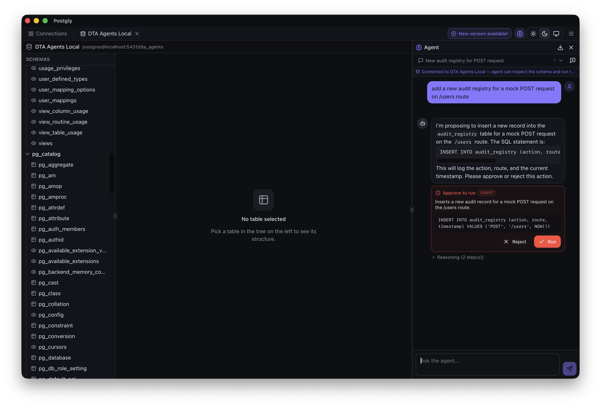

<div align="center">


**Talk to your PostgreSQL — local-first client with a built-in AI agent.**

[](https://github.com/alissonpelizaro/postgly/releases/latest)
[](#license)

### ⬇️ Download

[**macOS — Apple Silicon**](https://github.com/alissonpelizaro/postgly/releases/latest/download/Postgly-macos-arm64.dmg) ·
[**macOS — Intel**](https://github.com/alissonpelizaro/postgly/releases/latest/download/Postgly-macos-x64.dmg) ·
[**Windows (.exe)**](https://github.com/alissonpelizaro/postgly/releases/latest/download/Postgly-windows-x64-setup.exe) ·
[**Linux (.AppImage)**](https://github.com/alissonpelizaro/postgly/releases/latest/download/Postgly-linux-x86_64.AppImage) ·
[**Linux (.deb)**](https://github.com/alissonpelizaro/postgly/releases/latest/download/Postgly-linux-amd64.deb)

</div>

---

## 🧠 Manage your database by talking to it



Open the brain button on the top bar and a real agent sits next to your tables. Ask it anything — it inspects your schema with live tool calls, runs SELECTs for you, and proposes writes. Destructive statements never run on their own: an inline approval card shows the SQL, statement kind, `WHERE`-less warnings, and an estimate before you click **Run**.

- **Conversational, not transcriptional.** Sessions live in the side panel, persist 180 days locally, can be renamed, deleted and exported as Markdown.
- **Real tools, not autocomplete.** `list_tables`, `describe_table`, `list_relations`, `run_select`, `run_write` — every step shows up in a collapsible reasoning trace.
- **Human-in-the-loop for writes.** INSERTs and UPDATE/DELETE-with-`WHERE` run inline; anything destructive (DROP, TRUNCATE, ALTER, `WHERE`-less DML) pauses for explicit approval.
- **Bring your own LLM.** Any OpenAI-compatible endpoint — OpenAI, Ollama, Groq, Together, custom. Keys live in the OS keyring.

---

## 📦 Install

Installers are **unsigned** — the scripts below download the latest release, install it to the standard location, and clear the macOS quarantine attribute for you. One command per OS.

### 🍎 macOS &nbsp;·&nbsp; 🐧 Linux

```bash
curl -fsSL https://raw.githubusercontent.com/alissonpelizaro/postgly/main/scripts/install.sh | bash
```

- macOS: downloads the right `.dmg` for your CPU (Apple Silicon or Intel), copies `Postgly.app` to `/Applications`, runs `xattr -cr` to clear quarantine.
- Linux: downloads the AppImage to `~/.local/bin/postgly` and marks it executable.

Pin a version with `POSTGLY_VERSION=v0.1.0 curl … | bash`.

### 🪟 Windows

In PowerShell:

```powershell
irm https://raw.githubusercontent.com/alissonpelizaro/postgly/main/scripts/install.ps1 | iex
```

Downloads the installer, removes the Mark of the Web (reduces SmartScreen friction), runs the installer. SmartScreen may still show *"Windows protected your PC"* on first launch — click **More info → Run anyway**.

---

### Alternative: manual download

If you prefer not to run a remote script, download the asset and install by hand.

| OS | Asset |
|---|---|
| macOS — Apple Silicon | [Postgly-macos-arm64.dmg](https://github.com/alissonpelizaro/postgly/releases/latest/download/Postgly-macos-arm64.dmg) |
| macOS — Intel | [Postgly-macos-x64.dmg](https://github.com/alissonpelizaro/postgly/releases/latest/download/Postgly-macos-x64.dmg) |
| Windows | [Postgly-windows-x64-setup.exe](https://github.com/alissonpelizaro/postgly/releases/latest/download/Postgly-windows-x64-setup.exe) |
| Linux AppImage | [Postgly-linux-x86_64.AppImage](https://github.com/alissonpelizaro/postgly/releases/latest/download/Postgly-linux-x86_64.AppImage) |
| Debian / Ubuntu | [Postgly-linux-amd64.deb](https://github.com/alissonpelizaro/postgly/releases/latest/download/Postgly-linux-amd64.deb) |

**macOS** — open the `.dmg`, drag **Postgly.app** into `/Applications`, then clear the quarantine attribute (required, the bundle is unsigned):

```bash
xattr -cr /Applications/Postgly.app
```

Without this, macOS refuses to launch with *"Postgly is damaged"*.

**Windows** — run the `.exe`. SmartScreen may show *"Windows protected your PC"* — click **More info → Run anyway**.

**Linux AppImage**:

```bash
chmod +x Postgly-linux-x86_64.AppImage && ./Postgly-linux-x86_64.AppImage
```

**Debian / Ubuntu**:

```bash
sudo dpkg -i Postgly-linux-amd64.deb && sudo apt-get install -f
```

---

## ⚡ Quickstart

1. **Save a connection** in the connection manager.
2. Open **Settings → LLM Config**, paste your provider's base URL + API key, pick a model, **Test connection**.
3. Open a database tab, click the **brain icon** on the top right, and start talking:

   > *"show me the top 10 customers by total order amount this year"*
   >
   > *"add a `last_seen_at timestamptz` column to users and backfill it from `updated_at`"*

The agent inspects your schema, runs the SELECT, returns rows. For writes, you approve from the card.

---

## 🆚 Postgly vs. the usual suspects

| | **Postgly** | **DBeaver** | **pgAdmin** |
|---|---|---|---|
| **Conversational AI agent** | ✅ Built-in, free, BYO LLM | ⚠️ Paid AI add-on, prompt-only | ❌ |
| **Agent runs SQL for you** | ✅ Read + gated writes via tools | ❌ Generates SQL, you run it | ❌ |
| **Human-in-the-loop on destructive ops** | ✅ Inline approval card + SQL preview | ❌ | ❌ |
| **Bring your own LLM endpoint** | ✅ Any OpenAI-compatible | ⚠️ Vendor-managed | — |
| **Setup time** | 🟢 Single installer, no JRE | 🟡 Bundled JRE, ~250 MB | 🟡 Server + Python stack |
| **Footprint** | 🟢 ~15 MB native app | 🔴 ~250 MB | 🔴 Python + Postgres server |
| **Cross-platform native binary** | ✅ macOS · Windows · Linux | ✅ (JVM) | ⚠️ Webapp |
| **Secrets storage** | ✅ OS keyring | ⚠️ App-managed | ⚠️ App-managed |
| **Open source** | ✅ | ✅ (Community) | ✅ |
| **PostgreSQL only** | ✅ Focused | ❌ Multi-DB | ✅ |

Postgly is opinionated: PostgreSQL only, small native bundle, the AI agent is a first-class feature instead of a paid add-on.

---

## 🛠 Contributing

```bash
make install   # frontend deps + cargo-llvm-cov
make dev       # desktop app with hot reload
make test      # full suite (unit + integration)
make build     # native bundle for the host OS
```

`make help` lists every target. CI enforces ≥90% backend coverage.

### Tech stack

Tauri 2 (Rust) · React 19 + TypeScript · Tailwind 4 · shadcn/ui · lucide-react.

### Releases

```bash
git tag v0.1.0 && git push origin v0.1.0
```

Builds and publishes installers for macOS, Windows and Linux to a draft GitHub Release.

---

## License

Private — all rights reserved.
